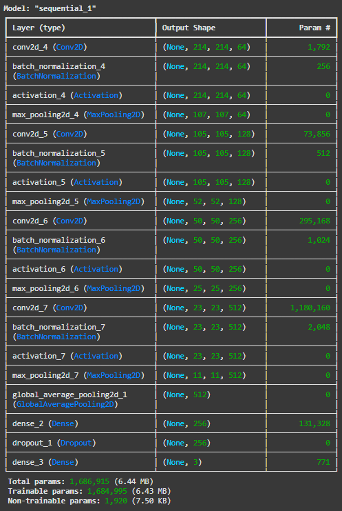

# Face-Mask-Detection
A convolutional Neural Network (CNN) based project for detecting whether a person is wearing a mask or not. The system uses OpenCV for real-time face detection and a trained deep learning model for mask classification.

# Overview
This project is a face mask detection system built using Convolutional Neural Networks (CNN) with TensorFlow/Keras and OpenCV. The goal is to classify whether a person in an image is wearing a mask correctly, not wearing a mask, or wearing it incorrectly. The model is trained on the "Face Mask Detection" dataset from Kaggle, which includes images of people with annotations for mask usage.
The system performs the following:

- Pre-processes the dataset by extracting faces from images using bounding boxes from XML annotations.
- Trains a CNN model to classify the mask status into 3 classes: "Without Mask", "With Mask", and "Incorrect Mask".
- Evaluates the model and saves it for inference.
- Tests the model on real-world images by detecting faces with Haar Cascade and predicting mask status.

This project demonstrates key concepts in computer vision, including data augmentation, CNN architecture, and real-time inference.

# Dataset
The dataset used is "Face Mask Detection" from Kaggle (by user andrewmvd). It contains:

- 853 images in .png format.
- Corresponding XML annotations in Pascal VOC format, including bounding boxes and labels for each person in the image.
- Labels: "with_mask", "without_mask", "mask_weared_incorrect".

Total processed samples after cropping faces: Approximately 4,000 (since some images have multiple people).

# Installation and Requirements
To run this project, you need Python 3.10+ and the following libraries. Install them using the requirements.txt file this way:
pip install -r requirements.txt

# Model Architecture
The CNN model consists of:

- 4 Convolutional layers with Batch Normalization and ReLU activation.
- MaxPooling for downsampling.
- Global Average Pooling to reduce parameters.
- Dense layers with Dropout for regularization.
- Output layer with Softmax for 3 classes.

+ Total parameters: 1,686,915

# Usage
1. Download and Pre-process the Dataset
Run the pre-processing script to load images, parse XML annotations, crop faces, and split into train/test sets.

2. Train the Model
Use the CNN model defined in the notebook.

3. Test the Model on Real Data
Load the saved model and test on a new image and see the output.

# Results

Training Accuracy: ~94% (after 20 epochs).
Validation Accuracy: ~93%.

Training Loss: 18% (after 20 epochs).
Validation Loss: ~21%.

# Conclusion
This project demonstrates the use of CNNs for real-time face mask detection. 
The model accurately detects mask status in most cases, but may struggle with poor lighting or occlusions.

Thank you for checking out this project! If you have any questions or suggestions, feel free to open an issue or pull request. Star the repo if you find it useful.

+ Abolfazl Gharedaghi | START: 8/13/2025 - END: 8/21/2025